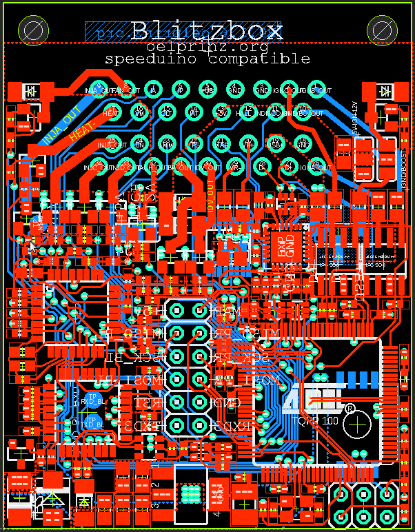
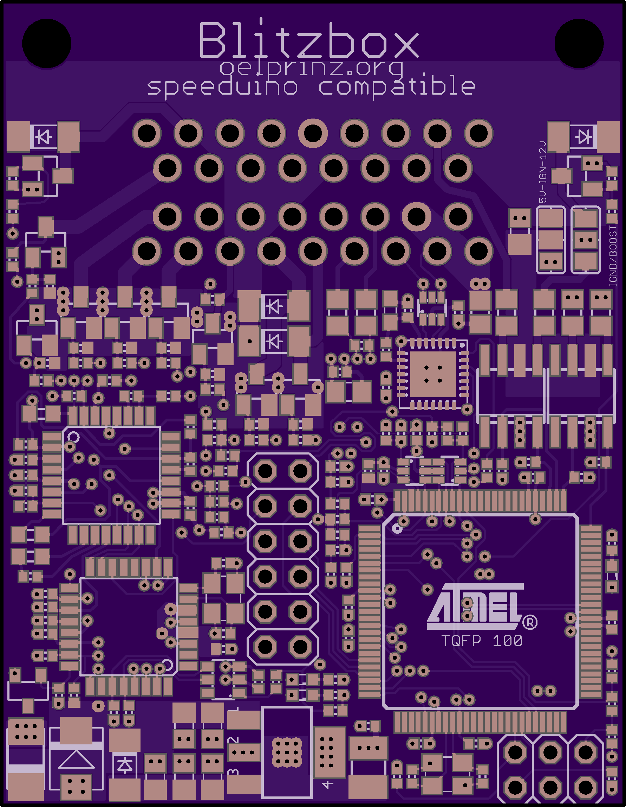
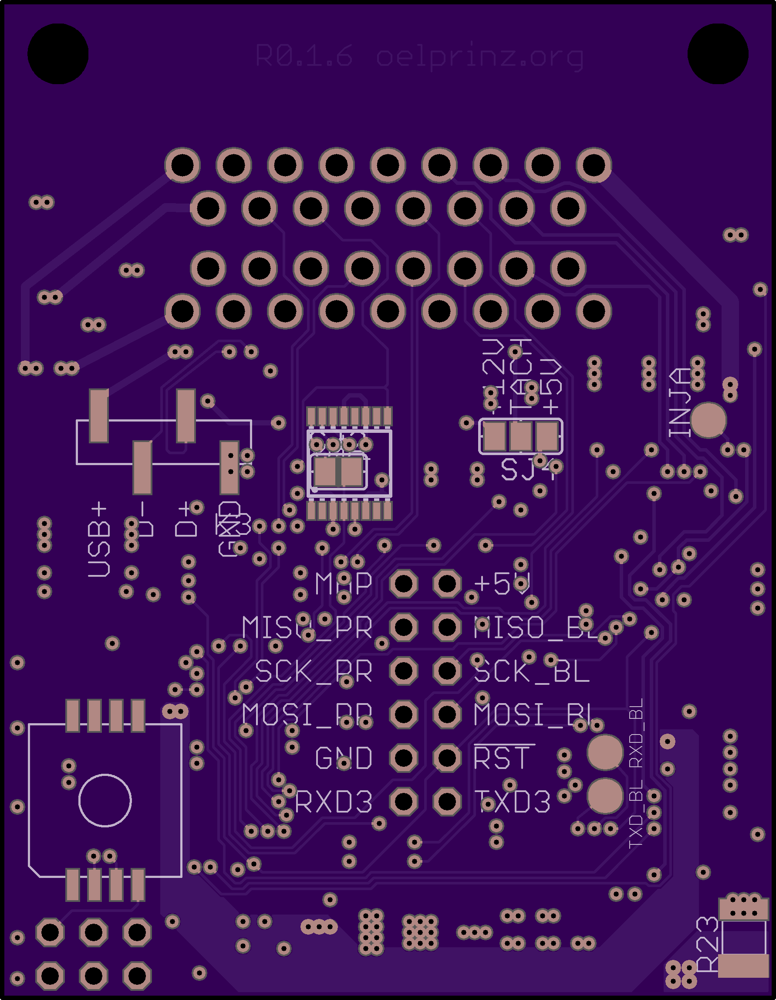
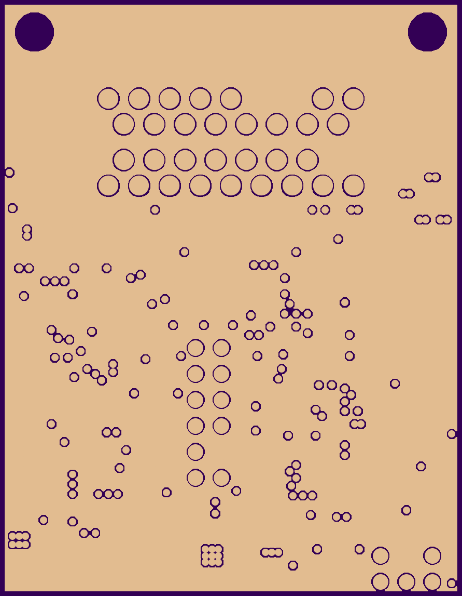
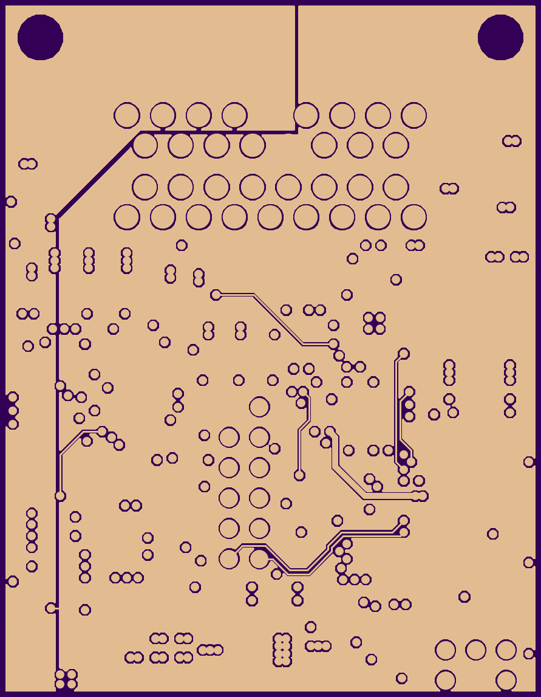
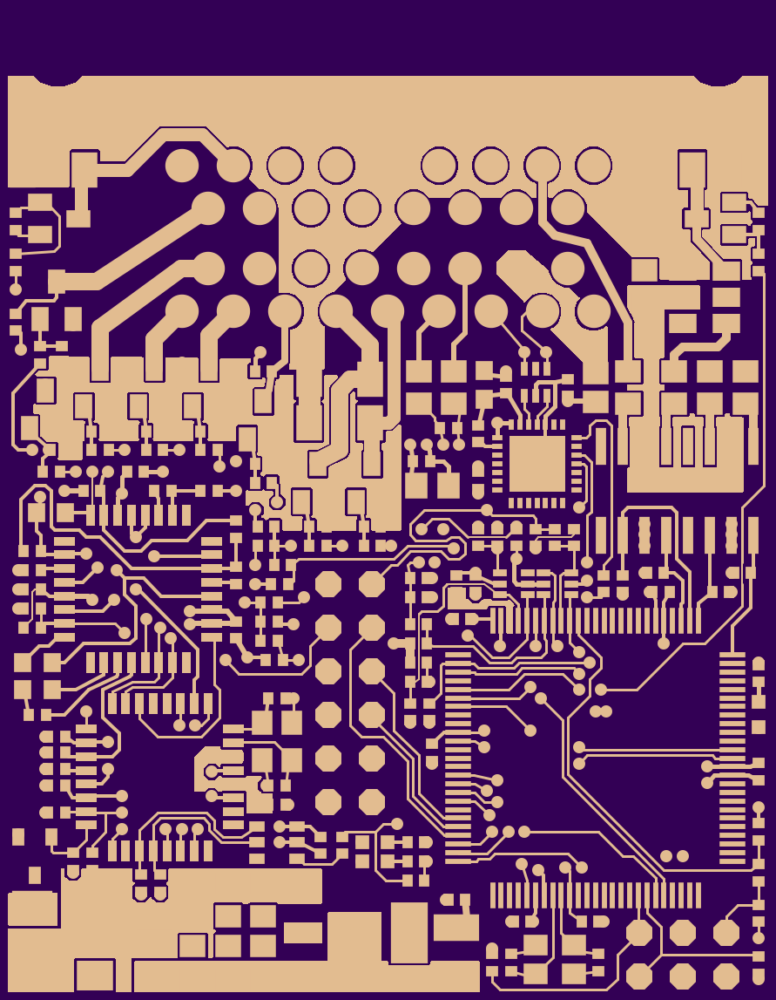
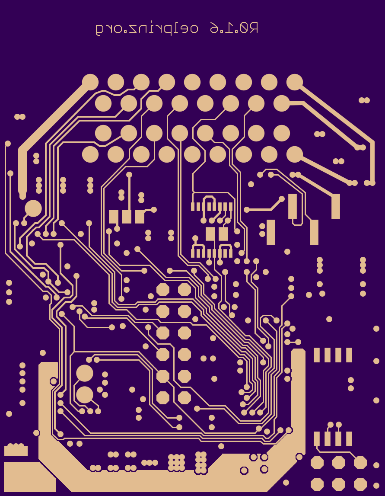
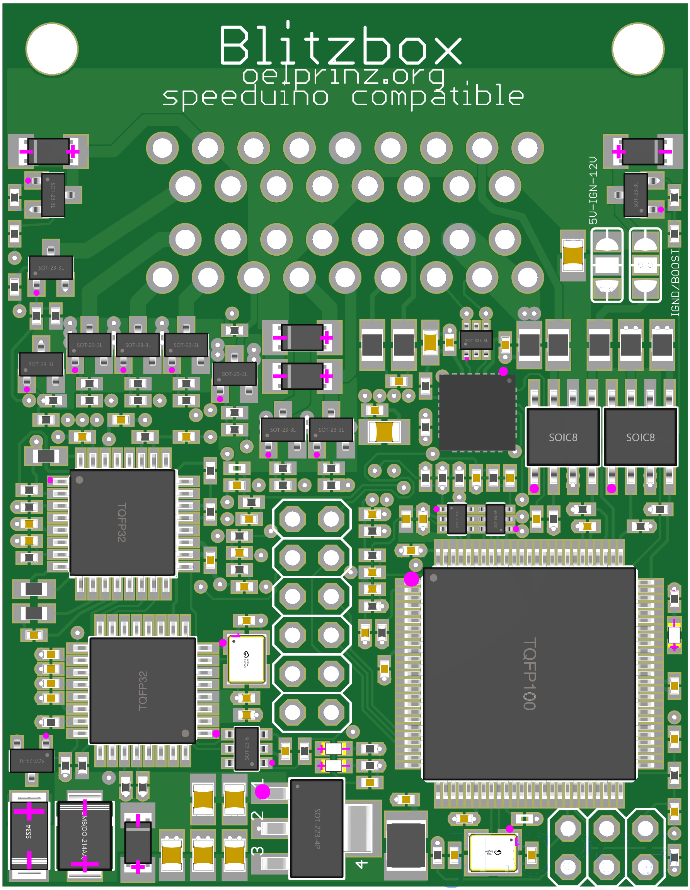
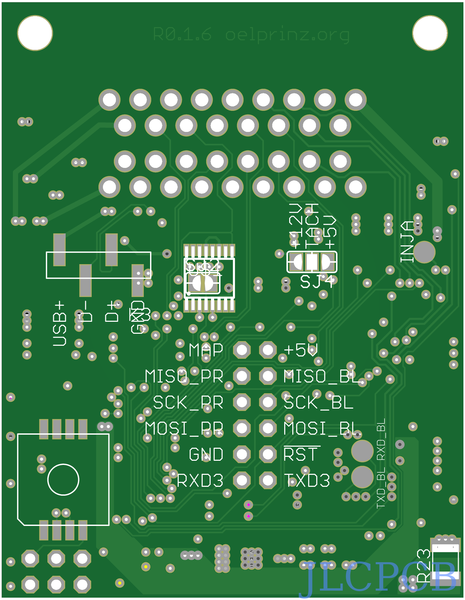

# blitzBOX - V0.1.6 - release candidate for final version 
 
ultra-low-cost and mini-sized ECU for speeduino firmware (Rev0.1.6 45 x 58 mm) 
Integrated Wideband Lambda Controller with Bosch CJ125 and LSU 4.9 
4-Layer highly integrated design - hand soldering possible but only recommended to people with really experienced soldering skills.  Hardware is optimized for assembly by professional assembly manufacturer 
supports 4 cylinder full sequential 

4 high impedance injectors 
4 active ignition coils 
1 crankshaft sensor with MAX9926 VR-conditioner (optional Hall Input without MAX9926) 
1 hall input for camshaft sensor 
6 analog inputs: CLT, IAT, TPS, BAT, LMM, MAP 
1 optional baro sensor MPXH6400A on connector side of pcb 
1 digital input for disco swaggering (aka. launch control) 

Onboard Wideband Lambda Controller with Bosch CJ125 (LSU 4.9) 

1 fuel pump out 
1 idle valve out 
1 tacho out (5/12V) 
1 boost out (optional with IGN_D out) 
1 fan out 

USB programming interface with CP2102 

16.09.2020: Betaversion 0.0.6 has gone into production - More infos coming soon.... 
30.09.2020: First initial tests of V0.0.6 have been made. Further tests still have to be done. Until now there was no significant or uncorrectable error in V0.0.6. Some minor improvements will lead to next version V0.0.7 
01.01.2021: Happy new year - Version 0.0.8 has been released 
20.05.2021: Betaversion 0.0.9 has been released 
26.05.2021: Betaversion 0.1.0 has been released 
26.08.2021: Betaversion 0.1.1 has been released 
07.12.2021: Betaversion 0.1.2 has been released 
25.04.2022: Betaversion 0.1.2 is running on a real car after two corrections which can be done manually. See correction proposals on issues tab here in GitHub. 
Next and hopefully final version will follow up soon. 
06.05.2022: Final version is getting closer. Also added some information how to wire the connector (interactive page): http://www.oelprinz.org/products/BlitzboxBL49sp/documentation/V0.1.4_and_newer/wiki/pinout_V0.1.4_and_newer_Connector_top_side.html More information/documentation coming soon 
26.08.2022: release candidate 1 (0.1.3) has been published 
10.11.2022: V0.1.3 became first official released version 
13.02.2023: V0.1.4 minor updates on smd footprints 
13.03.2023: V0.1.5 minor updates 
22.03.2023: V0.1.6 minor updates on power supply - release candidate for final version 

[Link to the original speeduino project](https://www.speeduino.com "speeduino homepage") 
 
Quick link to Rev0.1.6 schematic: https://github.com/oelprinz-org/BlitzboxBL49sp/blob/master/hardware/Rev0.1.6/schematics_blitzbox_v0.1.6.pdf  

Quick link to Rev0.1.6 iBOM: http://oelprinz.org/products/BlitzboxBL49sp/hardware/V0.1.6/iBOM/ibom.html  

   
   
   
   
  
   
  
  
  
  
   
   

 

   

