# BlitzboxBL49sp - Preview 
BlitzboxBL49sp 
low-cost and mini-sized ECU for speeduino firmware (Rev0.0.1 45 x 55 mm / Rev0.0.2 47 x55 mm) 
Integrated Wideband Lambda Controller with Bosch CJ125 and LSU 4.9 
4-Layer highly integrated design - hand soldering possible but only recommended to people with really experienced soldering skills.  Hardware is optimized for assembly by professional assembly manufacturer 
supports 4 cylinder full sequential 

4 high impedance injectors 
4 active ignition coils or 1 passive ignition coil with separate ground plane 
1 crankshaft sensor with VR-conditioner (two revisions: MAX9924 or NCV1124) 
1 hall input for camshaft sensor 
6 analog inputs: CLT, IAT, TPS, BAT, LMM, MAP 
1 optional baro sensor MPXH6400A on bottom side 
1 digital input for disco swaggering (aka. launch control) 

Onboard Wideband Lambda Controller with Bosch CJ125 (LSU 4.9) 

1 fuel pump out 
1 idle valve out 
1 tacho out 
1 boost out 

USB programming interface with CP2104 

More infos coming soon.... 

[Link to the original speeduino project](https://www.speeduino.com "speeduino homepage") 
 
Quick link to Rev0.0.3 schematic: https://github.com/oelprinz-org/BlitzboxBL49sp/blob/master/hardware/Rev0.0.3/schematics.pdf  

  Rev0.0.3 with MAX9924 
 
  
  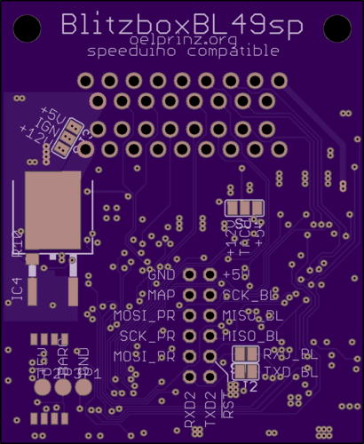 
  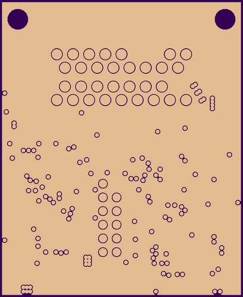
  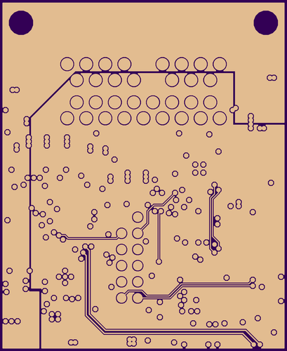
  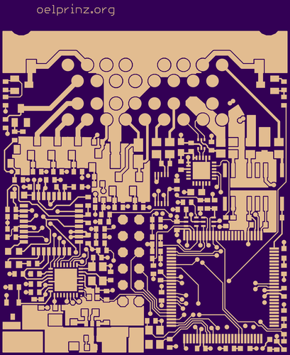
  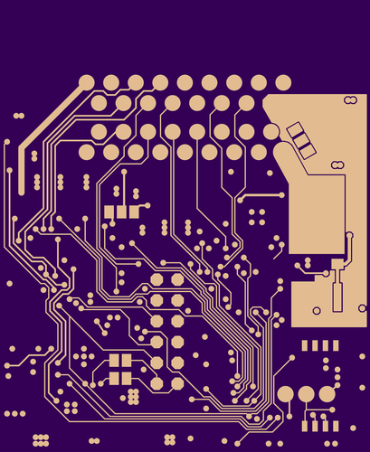

 

   
Quick link to Rev0.0.2 schematic: https://github.com/oelprinz-org/BlitzboxBL49sp/blob/master/hardware/Rev0.0.2/schematics.pdf  
  Rev0.0.2 with NCV1124 
 
  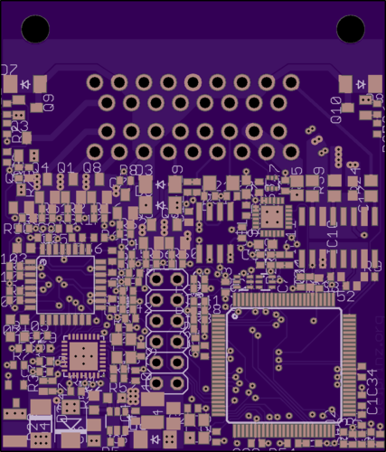
  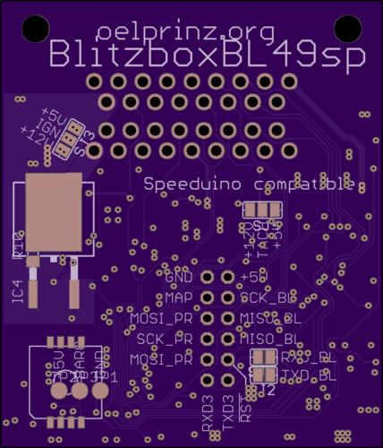 
  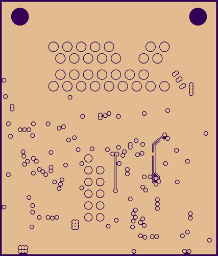
  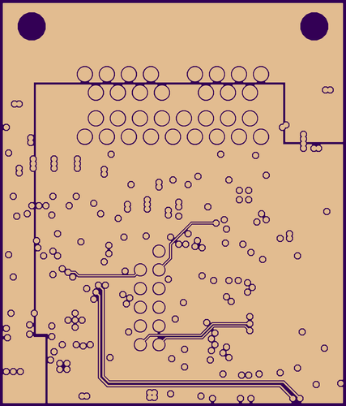
  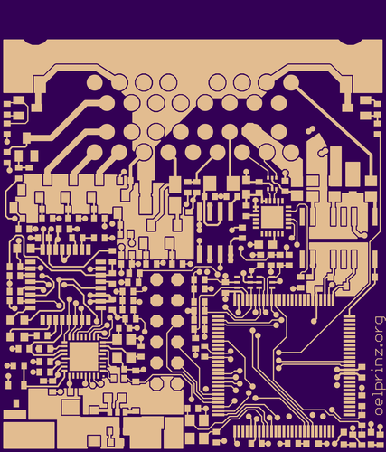
  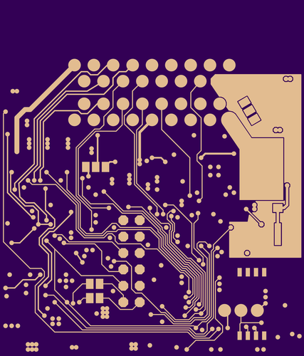

