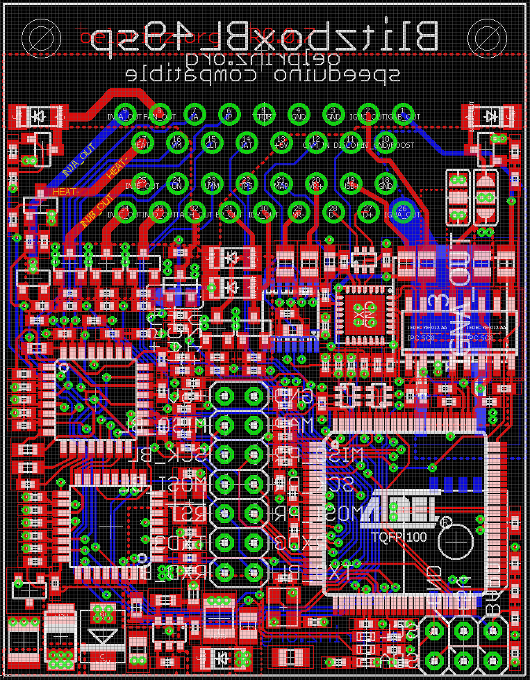
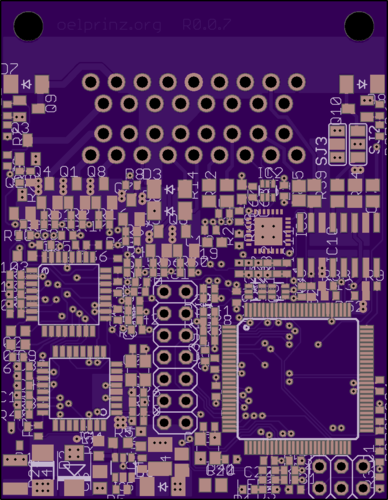
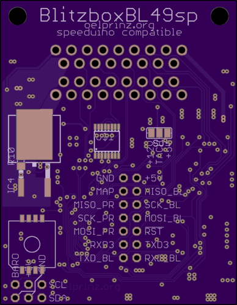
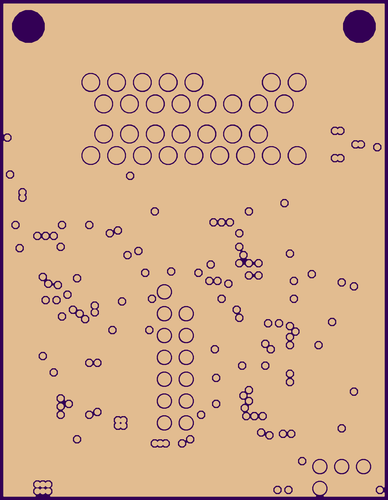
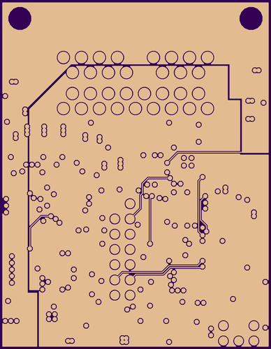
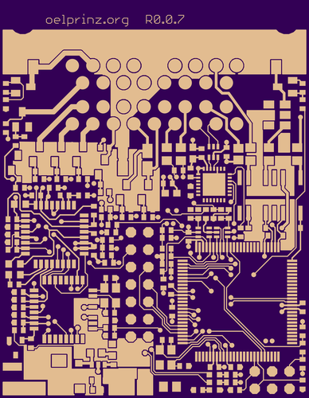
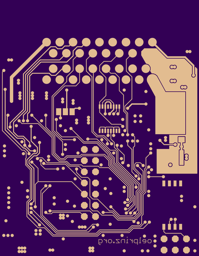

# BlitzboxBL49sp - Preview 
BlitzboxBL49sp 
ultra-low-cost and mini-sized ECU for speeduino firmware (Rev0.0.7 45 x 58 mm) 
Integrated Wideband Lambda Controller with Bosch CJ125 and LSU 4.9 
4-Layer highly integrated design - hand soldering possible but only recommended to people with really experienced soldering skills.  Hardware is optimized for assembly by professional assembly manufacturer 
supports 4 cylinder full sequential 

4 high impedance injectors 
4 active ignition coils or 1 passive ignition coil with separate ground plane 
1 crankshaft sensor with MAX9926 VR-conditioner 
1 hall input for camshaft sensor 
6 analog inputs: CLT, IAT, TPS, BAT, LMM, MAP 
1 optional baro sensor MPXH6400A on bottom side 
1 digital input for disco swaggering (aka. launch control) 

Onboard Wideband Lambda Controller with Bosch CJ125 (LSU 4.9) 

1 fuel pump out 
1 idle valve out 
1 tacho out 
1 boost out (optional with IGN_D out) 
1 fan out 

USB programming interface with CP2102 

16.09.2020: Version 0.0.6 has gone into production - More infos coming soon.... 
30.09.2020: First initial tests of V0.0.6 have been made. Further tests still have to be done. Until now there was no significant or uncorrectable error in V0.0.6. Some minor improvements will lead to next version V0.0.7 

[Link to the original speeduino project](https://www.speeduino.com "speeduino homepage") 
 
Quick link to Rev0.0.7 schematic: https://github.com/oelprinz-org/BlitzboxBL49sp/blob/master/hardware/Rev0.0.7/schematics.pdf  

Quick link to Rev0.0.7 iBOM: https://oelprinz.000webhostapp.com/BlitzboxBL49sp/V0.0.7/iBOM/ibom.html  

   
   
  
   
  
  
  
  

 

   

