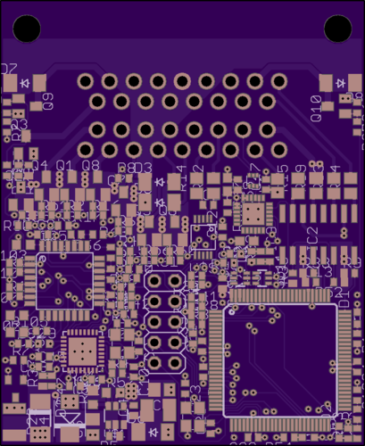
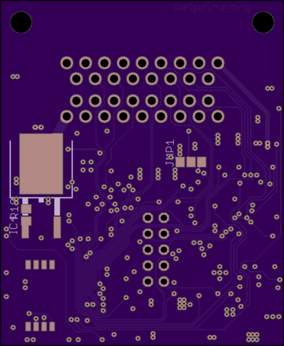
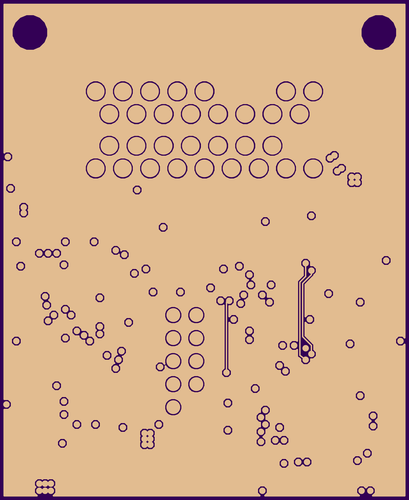
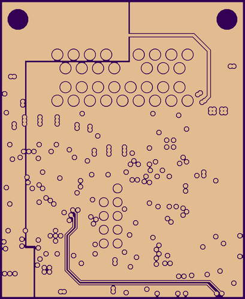
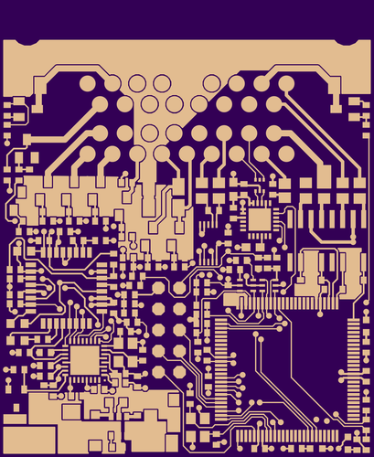
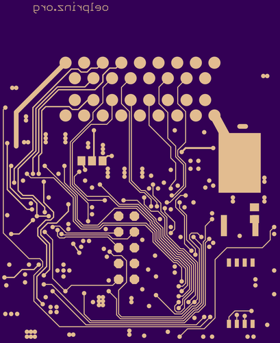

# BlitzboxBL49sp
BlitzboxBL49sp - Preview
low-cost and mini-sized ECU for speeduino firmware (45.1 x 55.1 mm)
Integrated Wideband Lambda Controller with Bosch CJ125 and LSU 4.9
supports 4 cylinder full sequential

[Link to the original speeduino project](https://www.speeduino.com "speeduino homepage")

  
   
  
  
  
  

